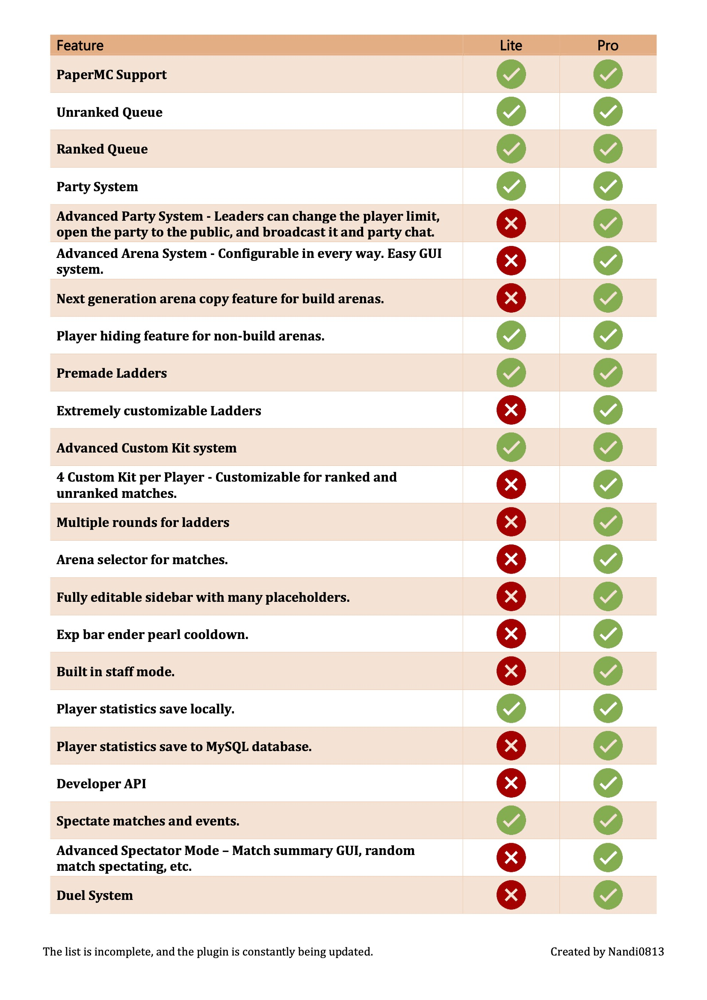

# ZonePractice Pro

ZonePractice Pro is a modular Minecraft practice plugin with ladders, arenas, events, FFA, party modes, match history, cosmetics, and PlaceholderAPI support.

<figure><figcaption>
Main systems overview
</figcaption></figure>

## Start here (new server owners)

1. [Getting Started](overview/getting-started.md)
2. [Ladder Setup](setup-guides/ladder-setup.md)
3. [Arena Setup](setup-guides/arena-setup.md)
4. [Event Setup](setup-guides/event-setup.md)
5. [Hologram Setup](setup-guides/hologram-setup.md)

## Reference pages

- [Configuration Files](informations/configuration-files.md)
- [Commands](informations/commands.md)
- [Permissions](informations/permissions.md)
- [Placeholder API](extra/placeholder-api.md)
- [For Developers](extra/for-developers.md)

## Official support

- Discord: [https://discord.gg/XFUhvJR9eN](https://discord.gg/XFUhvJR9eN)
