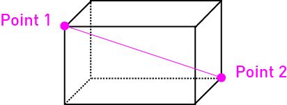
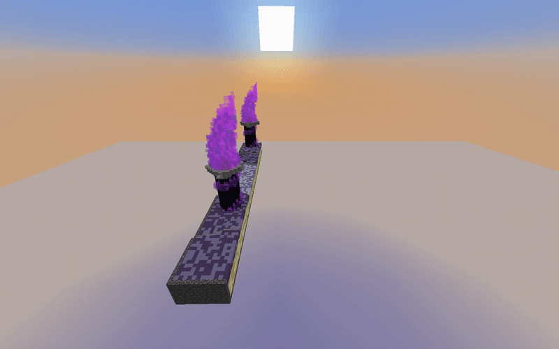

# Arena Setup

Set up ladders first, then arenas.

## Step 1: Create a new arena

Run:

- `/arena create <name>`

Pick arena type in the GUI.

<figure><figcaption><p>Arena type selector</p></figcaption></figure>

After type selection, arena setup GUI opens.

<figure><figcaption><p>Build arena setup</p></figcaption></figure>

<figure><figcaption><p>FFA arena setup</p></figcaption></figure>

## Step 2: Set arena icon

1. Hold item for icon.
2. (Optional) Rename item with `/practice rename <name>`.
3. Run `/arena set icon <arena>`.

## Step 3: Build/paste map into `arenas` world

Use your build tool (FAWE recommended), then run setup.

## Step 4: Start setup wand mode

Run:

- `/arena setup <arena>`

You receive a setup wand. Use it to configure region and points.

Wand usage basics:

- Left/Right click to set positions depending on current mode
- Shift + click to switch setup mode
- Drop wand (Q) to exit

For region selection, make sure the whole map is inside your 2 corners.

<div align="left"><figure><figcaption><p>Corner selection example</p></figcaption></figure></div>

## Step 5: Assign ladder types/ladders

In the arena setup GUI:

1. Assign allowed ladder types.
2. Review auto-assigned ladders.
3. Remove any ladder you do not want in this arena.

<div data-full-width="true"><figure><figcaption><p>Assign ladder types</p></figcaption></figure></div>

<figure><figcaption><p>Fine-tune ladder assignments</p></figcaption></figure>

## Step 6: Type-specific setup

If your arena is bed-based:

- Set required bed positions through setup modes

If your arena is portal-based:

- Set required portal regions through setup modes

## Step 7: Optional advanced settings

- Portal protection: `/arena set portalprot <arena> <radius>`
- Side build limit: `/arena set sidebuildlimit <arena> <value>`
- Party FFA center: `/arena set partyffacenter <arena>`

### Making arena copying faster

By default, ZonePractice copies arenas using its own built-in method. For large maps, you can speed this up significantly:

1. **Enable fast copy** — set `ARENA.FAST-COPY.ENABLED: true` in config.yml. This uses more server resources but copies much faster.
2. **With FAWE** — if you have FastAsyncWorldEdit installed, set `ARENA.FAST-COPY.USE-FAWE: true` for even faster performance.

```yaml
ARENA:
  FAST-COPY:
    USE-FAWE: true      # requires FAWE plugin
    ENABLED: true       # enables fast copy mode
    MULTIPLIER: 10      # speed multiplier (higher = faster but more lag)
```

Start with `MULTIPLIER: 10` and increase carefully if your server can handle it.

## Step 8: Enable and test

Enable only after:

- Icon set
- Region corners set
- Spawn points set
- Required bed/portal points set (if needed)
- At least 1 compatible ladder assigned

Then run test matches.

## Build arena copies

Build arenas use async copy generation in `arenas_copy`.

<figure><figcaption><p>Asynchronous arena copy creation</p></figcaption></figure>

## Management commands

- `/arena info <arena>`
- `/arena teleport <arena>`
- `/arena enable <arena>`
- `/arena disable <arena>`
- `/arena freeze <arena>`
- `/arena stop <arena>`
- `/arena delete <arena>`

## Troubleshooting

If setup wand does not appear:

- Confirm arena is disabled
- Confirm you have `zpp.setup`
- Re-run `/arena setup <arena>`

If arena cannot be enabled:

- Re-check required points for this arena type
- Re-check ladder assignment
- Confirm region corners are valid
