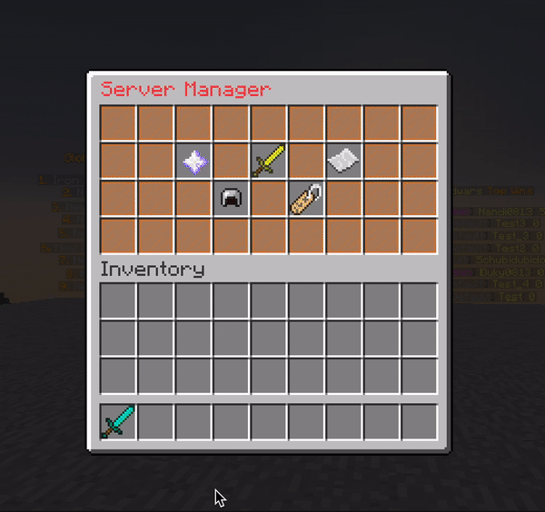
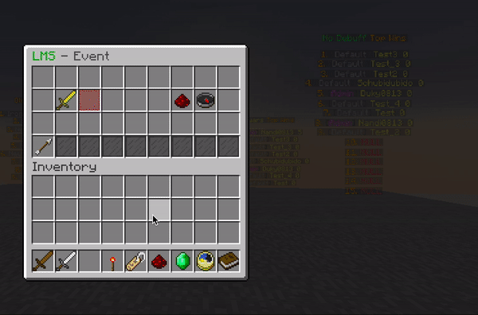
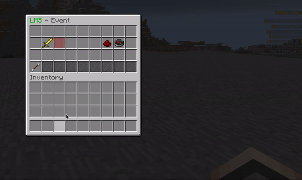

# Event Setup

ZonePractice supports 7 event modes:

| Event | Command | Type | Description |
| --- | --- | --- | --- |
| LMS | `/event lms` | FFA | Last Man Standing — drop inventory on death |
| OITC | `/event oitc` | FFA | One In The Chamber — 5 lives per player |
| TNT Tag | `/event tnttag` | One-vs-All | Tagged player explodes |
| Brackets | `/event brackets` | 1v1 | Tournament-style bracket elimination |
| Sumo | `/event sumo` | 1v1 | Knockback-only sumo elimination |
| Splegg | `/event splegg` | FFA | Shoot eggs to break blocks under players |
| Juggernaut | `/event juggernaut` (alias: `jn`) | One-vs-All | One player is the juggernaut |

## Step 1: Configure event settings in `config.yml`

Review the `EVENT` section and per-event blocks (LMS, OITC, TNTTAG, BRACKETS, SUMO, SPLEGG, JUGGERNAUT). For major edits, restart server after saving.

Key settings per event:
- `WINNER-COMMAND` — commands run on winner (placeholders: `%player%`)
- `AUTO-EVENTS` — scheduled start times (e.g. `"18:30"`)
- Per-event settings (OITC `PLAYER-LIFE`, Splegg `BREAKABLE-MATERIALS`, etc.)

## Step 2: Set event icon in setup GUI

Open event setup and replace default icon.

<figure><figcaption><p>Set event icon</p></figcaption></figure>

## Step 3: Configure basic event settings

Use event setup GUI to set core options.

<figure><figcaption><p>Event settings GUI</p></figcaption></figure>

## Step 4: Configure event-specific options

Each event type has its own required options. Some events need a kit (items/armor), others use effects. Access these options through the event setup GUI or commands:

- `/event lms` — configure LMS settings
- `/event oitc` — set player lives, kit
- `/event tnttag` — configure tagged item, explosion behavior
- `/event brackets` — set kit, rounds
- `/event sumo` — set effects, arena
- `/event splegg` — configure breakable blocks, egg launcher item
- `/event juggernaut` — set juggernaut effects, kit

Run the command without arguments to see available options.

## Step 5: Set event map area

1. Build/paste map in `arenas` world.
2. Get marker item from event map setup.

<figure><figcaption><p>Get map marker item</p></figcaption></figure>

3. Select 2 corners so full map is enclosed.

<div align="left"><figure><figcaption><p>Corner selection</p></figcaption></figure></div>

## Step 6: Set spawn markers and scan

Place player position markers, then scan map.

<div align="left"><figure><figcaption><p>Spawn marker example</p></figcaption></figure></div>

Notes:

- For Brackets/Sumo, scan uses only the needed marker count.
- Large maps can take longer to scan.

## Step 7: Enable and host

Host flow:

- `/event host` to open host GUI
- `/event join` for players
- `/event stop <event_name>` to stop (permission required)

## Automatic events

Define per-event schedule times in `config.yml` under each event block's `AUTO-EVENTS`:

```yaml
LMS:
  AUTO-EVENTS:
    - "18:30"
JUGGERNAUT:
  AUTO-EVENTS:
    - "19:00"
```

Set `EVENT.AUTO-EVENTS: true` to enable the auto-event system globally.

## Configuration highlights

```yaml
EVENT:
  MULTIPLE: false              # Allow simultaneous events
  DUEL:
    POST-KILL-DELAY: 3         # Seconds between duel-event eliminations
  ENDERPEARL-COOLDOWN: 10       # Ender pearl cooldown in events
  BROADCAST:
    ENABLE: true
    MESSAGE-TO:
      IN-PARTY: true
      IN-UNRANKED-MATCH: true
      IN-RANKED-MATCH: false
      IN-EVENT: true
```

## Beginner troubleshooting

If players cannot host:

- Check `zpp.event.host` or `zpp.event.host.all`
- Check specific permission like `zpp.event.host.lms`

If event cannot start:

- Re-check icon/settings/map/spawn setup
- Re-run map scan after region edits
