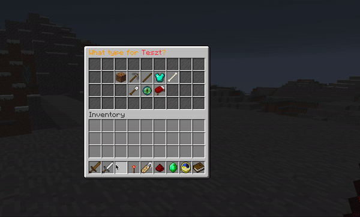
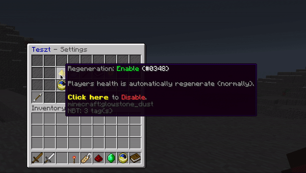

# Ladder Setup

This guide is written as a safe step-by-step flow for first-time admins.

## Before you begin

Make sure:

- You can run `/setup`
- You already set lobby with `/practice lobby set`

## Default ladders created automatically

These are generated in `plugins/ZonePracticePro/ladders/`:

`archer`, `axe`, `battlerush`, `bedwars`, `boxing`, `bridges`, `builduhc`, `crystal`, `debuff`, `fireball`, `gapple`, `mace`, `mlgrush`, `nodebuff`, `pearlfight`, `sg`, `skywars`, `soup`, `spear`, `spleef`, `sumo`, `sword`, `tntsumo`, `vanilla`.

You can edit these or create new ladders.

## Step 1: Create a ladder

Run:

- `/ladder create <name>`

A ladder type selector GUI opens.

<figure><figcaption>
Ladder type selector
</figcaption></figure>

## Step 2: Choose a ladder type

Available types include:

- `BASIC`
- `BUILD`
- `SUMO`
- `TNT_SUMO`
- `BOXING`
- `PEARL_FIGHT`
- `SPLEEF`
- `SKYWARS`
- `BEDWARS`
- `FIREBALL_FIGHT`
- `MLG_RUSH`
- `BRIDGES`
- `BATTLE_RUSH`

After choosing type, the ladder setup GUI opens.

<figure><figcaption>
Ladder setup GUI
</figcaption></figure>

## Step 3: Set icon and display name

1. Hold the item you want as icon.
2. (Optional) Rename it with `/practice rename <name>`.
3. Run `/ladder set icon <ladder>`.

Tip: the item display name becomes the ladder display name in menus.

## Step 4: Set inventory and effects

Set inventory:

- `/ladder set inventory <ladder>`

Set effects:

- `/ladder set effect <ladder>`

Then adjust ladder settings in GUI.

<figure><figcaption>
Ladder settings
</figcaption></figure>

## Step 5: Assign match types and final settings

In ladder settings GUI:

- Enable at least one match type
- Configure ranked/unranked behavior
- Configure type-specific options (for example SkyWars loot, Boxing hit goal)

### Per-ladder configurable settings

- **Hearts / Max Health** — custom health per ladder (`ladder max health`)
- **Match types** — select which match types are available (Duel, Party FFA, etc.)
- **Ender pearl cooldown** — override the global cooldown per ladder
- **Wind charge cooldown** — override per ladder
- **Golden apple cooldown** — override per ladder
- **Firework rocket cooldown** — override per ladder
- **Ranked/unranked** — enable or disable per weight class
- **Build limit** — override default arena build limit

Ladder type-specific options:

| Type | Extra options |
| --- | --- |
| BOXING | Custom attack cooldown, hit goal |
| SKYWARS | Chest loot configuration |
| BEDWARS | Bed break mechanics |
| BRIDGES | Regenerating arrow settings |
| AXE | Shield stun mechanics |
| TNT_SUMO | Explosion physics (radius, multipliers, falloff) |
| FIREBALL_FIGHT | Fireball speed, yield, explosion knockback |

## Step 6: Enable and test

Before enabling, verify:

- Icon is set
- Inventory is set
- Match type is set
- Type-specific required options are complete

Then run test fights.

## Management commands

- `/ladder info <ladder>`
- `/ladder freeze <ladder>`
- `/ladder stop <ladder>`
- `/ladder delete <ladder>`

## Important safety notes

- Edit ladders while disabled whenever possible.
- If players are currently fighting, use `/ladder stop <ladder>` before major edits.

## Troubleshooting

If `/ladder set icon` fails:

- Hold a real item (not air)
- Make sure it has a display name

If inventory does not save:

- Confirm ladder is not enabled
- Re-run `/ladder set inventory <ladder>` and save properly
